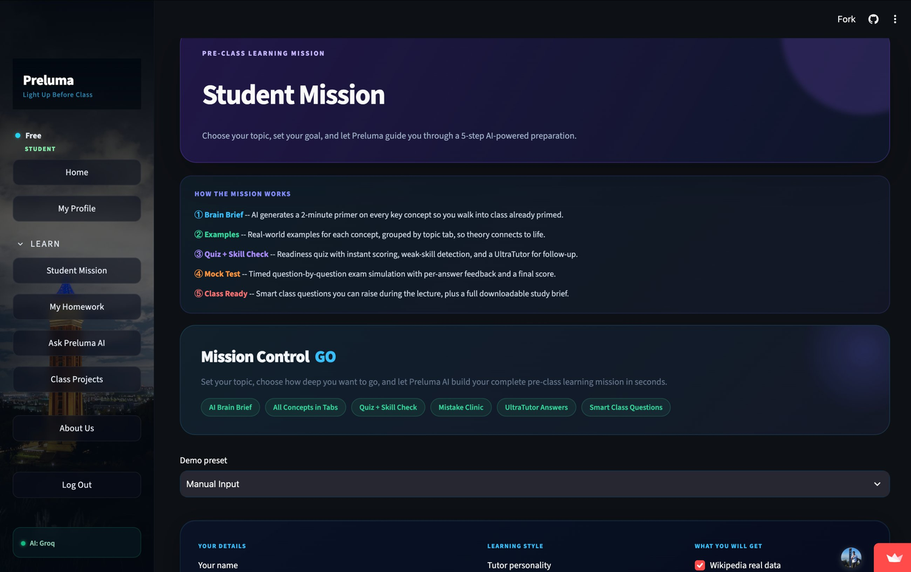
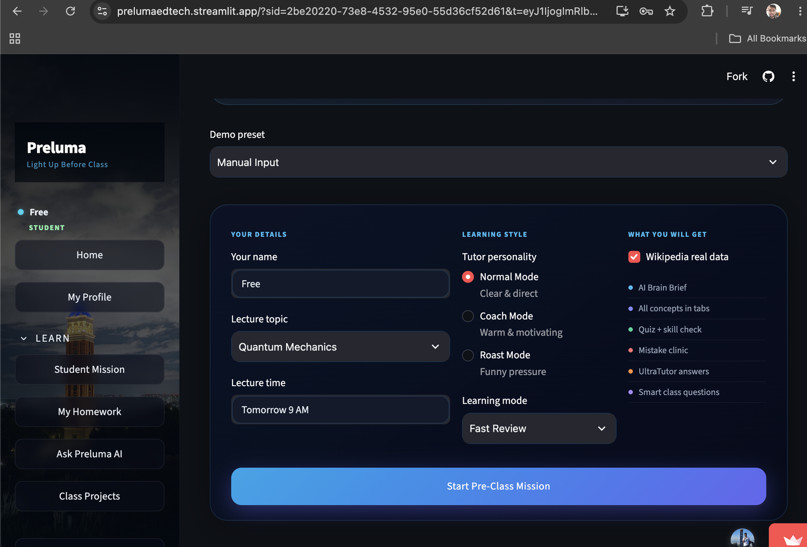
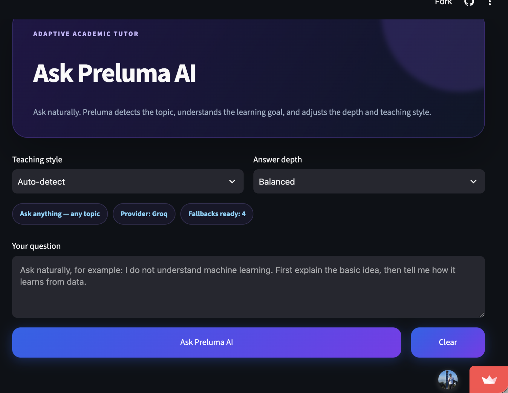
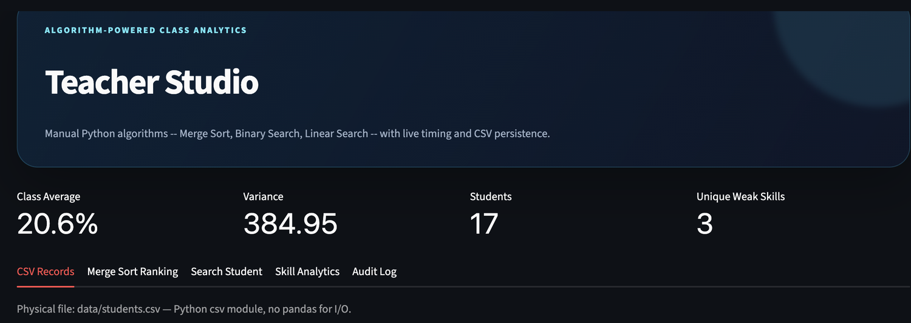

<div align="center">

# 🎓 Preluma

### An AI-powered adaptive pre-class learning platform

Built for Yunnan University's computing courses — turns passive pre-class reading into a guided, AI-assisted preparation workflow.

[](https://prelumaedtech.streamlit.app/)
[](#)
[](#)
[](#)
[](#)
[](#)

**[▶ Open the live app](https://prelumaedtech.streamlit.app/)**

<sub>Hosted on Streamlit Community Cloud — if the app has been idle it may take a few seconds to wake up.</sub>

</div>

---

## 🔑 Trying the live app

The app opens on a login screen. Choose **Student → New Student? Register Here** — registration is free and instant, no email confirmation — then open **Student Mission** to see the full five-step flow. The screenshots below show what is inside if you would rather not sign up.

## 🎬 Screenshots

**Student Mission** — the five-step guided flow



| Mission setup | Ask Preluma AI |
|---|---|
|  |  |

**Teacher Studio** — class analytics built on the hand-written algorithms



<sub>Student records are omitted from this screenshot to protect classmates' data.</sub>

---

## 📌 The problem

Students arrive at lectures underprepared. Research puts average pre-class reading at under forty minutes, most of it passive scanning. Textbook chapters and PDF handouts give **no adaptive feedback, no way to surface misconceptions, and no guidance on what to prioritise** — so remediation eats into class time that should go to higher-order learning.

Existing AI tutors don't close the gap either: enterprise platforms (Khanmigo, Duolingo Max) aren't configurable per course and carry subscription fees, while open-source alternatives need self-hosted infrastructure. There was no **course-specific, zero-cost-to-student, cloud-deployable** option.

## 💡 What Preluma does

A five-step guided **Student Mission** replaces passive reading:

1. **Brain Brief** — a two-minute AI primer on every key concept, so you walk into class already primed
2. **Examples** — real-world examples per concept, grouped by topic tab, connecting theory to life
3. **Quiz + Skill Check** — a readiness quiz with instant scoring, weak-skill detection, and an **UltraTutor** for follow-up
4. **Mock Test** — a timed, question-by-question exam simulation with per-answer feedback and a final score
5. **Class Ready** — smart questions to raise during the lecture, plus a downloadable study brief

A **Mistake Clinic** collects wrong answers and explains them rather than just marking them. Students choose a tutor personality (**Normal**, **Coach**, or **Roast** mode), a learning depth (**Fast Review** or **Deep Understanding**), and can pull real Wikipedia data into the brief.

A five-tier **rank system** (Beginner → Explorer → Achiever → Scholar → Master) rewards sustained engagement.

### Teacher Studio

Teachers get algorithm-powered class analytics: class average, score variance, student count and unique weak skills, plus tabs for **CSV records, Merge Sort ranking, student search, skill analytics and an audit log** — all running the hand-written algorithms with live timing and CSV persistence.

## 🏗️ Architecture highlights

### Multi-provider LLM failover

The most interesting engineering problem in the project. Free-tier LLM endpoints rate-limit and go down constantly, which would make an educational tool unusable at exactly the wrong moment. Preluma integrates **eight providers** — Groq, Cerebras, Mistral, OpenRouter, Together, OpenAI, Anthropic and Gemini — behind a **seven-step sequential failover chain** with a 20-second per-call timeout, so a student's request survives individual provider outages without any change in the interface.

The tutor surfaces this live: the interface shows the active provider and how many fallbacks are still ready, so the resilience is visible rather than hidden.

### Dual-mode persistence

**Supabase (PostgreSQL) with twelve relational tables** is the production store; the app falls back to local storage when the cloud is unavailable, so a demo or a flaky connection never blocks a session.

### Course constraints, honoured

The course required the analytical core to use **only the Python standard library** — no pandas, numpy or scikit-learn. Sorting and searching are implemented by hand in `algorithms_core.py`, and a dedicated test (`test_no_pandas_in_core.py`) enforces that boundary in CI rather than trusting discipline.

## 🧱 Tech stack

| Layer | Technology |
|---|---|
| Web framework | Streamlit |
| Language | Python (standard library only in the analytical core) |
| AI | 8 LLM providers behind a sequential failover layer |
| Database | Supabase / PostgreSQL (12 tables) + local fallback |
| Charts | Plotly |
| Content | 29 topic packs + Wikipedia integration |
| Testing | pytest, 13 test suites |
| Hosting | Streamlit Community Cloud |

## 📁 Module map

```
streamlit_app.py     entry point, navigation and page shell
engine.py            Student Mission flow and session orchestration
llm.py               8-provider LLM layer with sequential failover
auth.py              authentication and role-based access
storage_core.py      dual-mode persistence (Supabase / local)
models.py            data models
algorithms_core.py   hand-written sorting and searching
analytics_core.py    engagement and performance analytics
homework_core.py     assignment workflow
project_core.py      project workspace
teacher.py           Teacher Studio dashboard
topics.py            29 curated topic packs
wiki_fetcher.py      Wikipedia content retrieval
data_quality.py      validation of generated and stored content
result_generator.py  report output
tests/               13 pytest suites
```

## 🚀 Run locally

```bash
git clone https://github.com/mamunur-ynu/Preluma-edtech.git
cd Preluma-edtech
pip install -r requirements.txt
cp secrets.example.toml .streamlit/secrets.toml   # then add your API keys
streamlit run streamlit_app.py
```

Add at least one LLM provider key in `.streamlit/secrets.toml`. The failover layer uses whichever providers it finds, so a single free-tier key (for example Groq) is enough to run the whole app.

```bash
pytest            # run the test suites
```

> **Security:** never commit a real `.streamlit/secrets.toml`. On Streamlit Cloud, configure keys through *Settings → Secrets*.

## 👥 Team & my contribution

A three-person final project for *Python Language Programming Practice*, School of Software & Artificial Intelligence, Yunnan University (Spring 2026).

| Member | Contribution |
|---|---|
| **MAMUN MD MAMUNUR RASHID** | Core platform, UI, **AI provider layer**, authentication, system architecture |
| FAHIM MD | Backend, storage, analytics, test suites |
| ISLAM MD JIARUL | Content and 29 topic packs, validation, Wikipedia integration, roadmap |

## 📚 Related work

**[Smart Campus Bus Tracker](https://github.com/mamunur-ynu/ynu-bus-tracker-app)** — a live full-stack route optimizer with a 3D campus view and an LLM tool-calling assistant. [Try it](https://ynu-bus-tracker.netlify.app)
